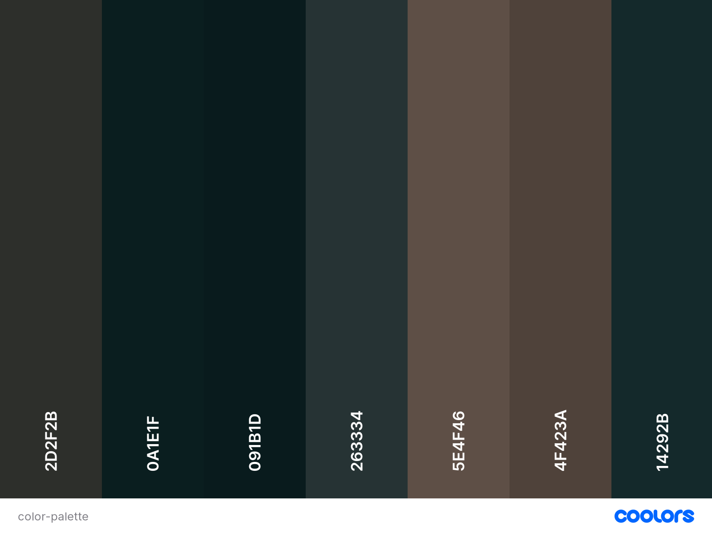
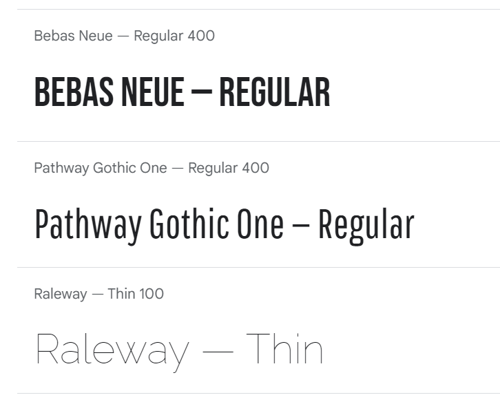
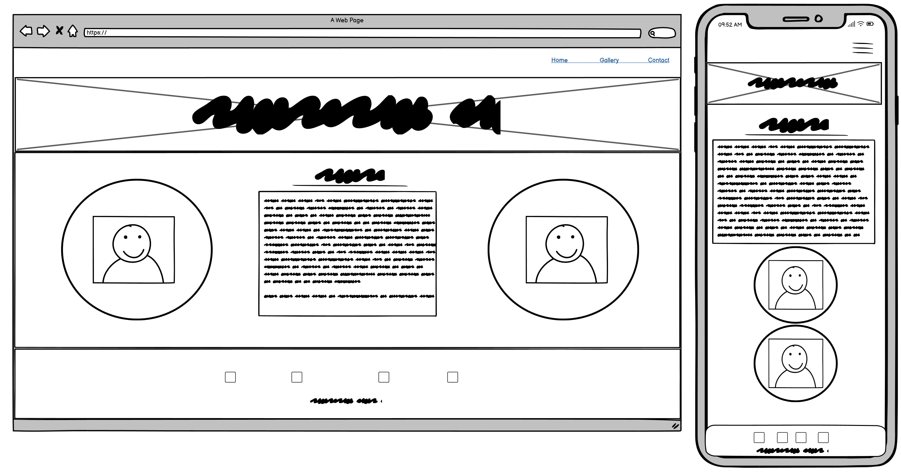
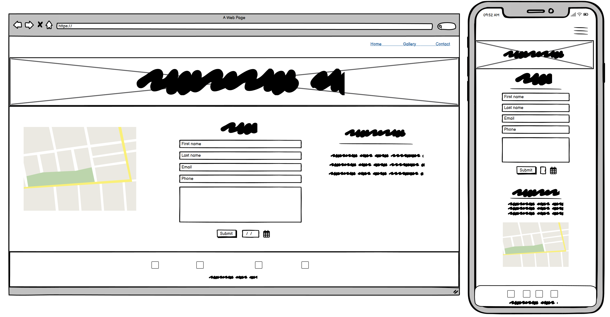
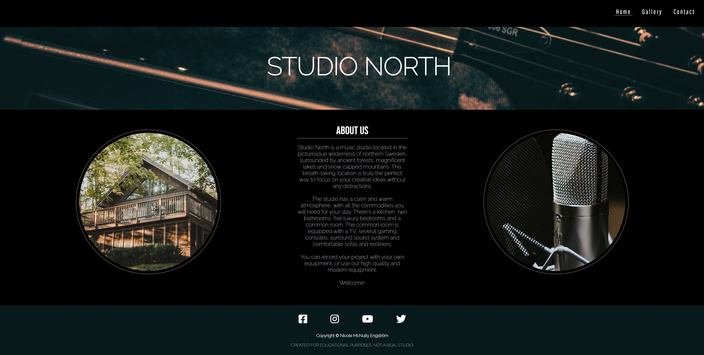
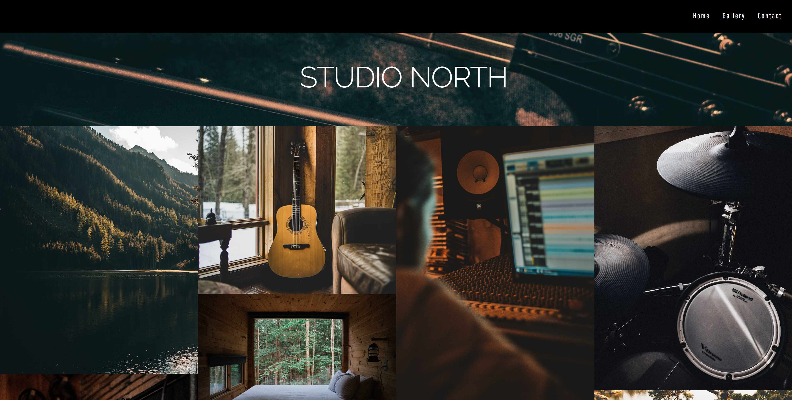
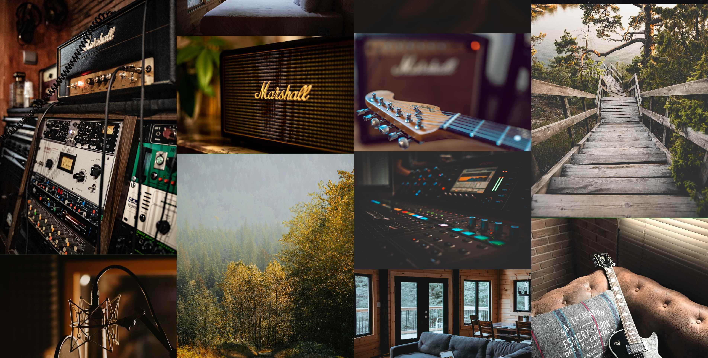
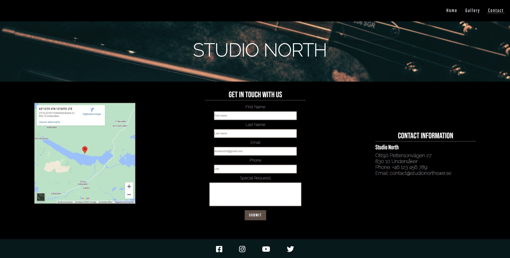

# Studio North

Studio North is an (imaginary) recording studio located in Northern Sweden. This studio is designed to be the perfect oasis for recording music without distractions. The website features a Home page with an 'About us' section, a Gallery page to view photos of the studio itself as well as the locale and surrounding nature. At the Contacts page there is contact information as well as a section to request a booking.

The reason I decided to go with this idea is because of my passion for music, as well as fond memories of my time as an intern in a music studio located in my hometown of Gothenburg, Sweden.

---

[View the live site here](https://nicolemne.github.io/project-portfolio-1/)

---

## CONTENTS

* [User Experience](#user-experience-ux)
  * [User Stories](#user-stories)

* [Design](#design)
  * [Colour Scheme](#colour-scheme)
  * [Typography](#typography)
  * [Imagery](#imagery)
  * [Wireframes](#wireframes)

* [Features](#features)
  * [General Features on Each Page](#general-features-on-each-page)
  * [Future Implementations](#future-implementations)
  * [Accessibility](#accessibility)

* [Technologies Used](#technologies-used)
  * [Languages Used](#languages-used)
  * [Frameworks, Libraries & Programs Used](#frameworks-libraries--programs-used)

* [Deployment & Local Development](#deployment--local-development)
  * [Deployment](#deployment)
  * [Local Development](#local-development)
    * [How to Fork](#how-to-fork)
    * [How to Clone](#how-to-clone)

* [Testing](#testing)

* [Credits](#credits)
  * [Code Used](#code-used)
  * [Content](#content)
  * [Media](#media)
  * [Acknowledgments](#acknowledgments)

---

## User Experience (UX)

Visitors who wish to hire a music studio to record their own ideas should find this website modern and inticing. My goal is for the visitor feel like this is a professional and luxury studio, with a beautiful location, and all neccessary supplies for recording an album in a distraction-free environment.

A description about the studio is accessible on the front page, and if the visitor wants to see more visual content, the gallery page provides the viewer with an idea of what the studio looks like, as well as the surrounding area. 

If you wish to contact the studio or make a request, the contact page provides all information needed. 

The website is viewable from different screen sizes, so every user can browse the the site.

### User Stories

For first time viewers I wanted to make the website visually inticing as well as having a clear understanding what the website is about. Together with the hero image and text, side images and introduction text, the first page quickly suggests that this is a music recording studio. 

If the front page has piqued the viewers interest, and they would like to learn more about the studio, they have a gallery to visit, as well as social media links, which are both easy accessible. 

## Design

### Colour Scheme

I've generated a color palette based off of the hero image, which I thought would be a well suited color scheme for the full website. 

[Coolors.co](https://coolors.co/) Is the website I've used to generate the colour palette. I've mainly used a black background, white text and #5E4F46 for underlines, and #091B1D as the footer background.

### Typography

I wanted to go with a sleek typography, and decided to go with Bebas Neue, Pathway Gothic One and Raleway, all of which I thought fitted well together. 
We can see Raleway being used on the hero image "Studio North". Pathway Gothic One is used as paragraph text, and Bebas Neue as lesser headers.

### Imagery

As the studio is located in a rural forest-y area in northern Sweden, I've chosen to use images that gives a warm and earthy feel. 

### Wireframes

The Wireframes I've made was created for desktop and mobile view. The original design I made has changed slightly, and the images below represent the new changes - which I have also tried my best to implement on the live site. 

I ended up not going for the hamburger navigation menu nor the calendar button in the end and settled for just the submit button and the regular navigation menu.

## Features

My website contains 3 pages, index.html which is the home page, gallery.html is the gallery page, and contact.html is the contact page. 

### Finished look of the Home page

### Finished look of the Gallery page
Because my screen is a little bit bigger I've had to crop the images to get full view. 

### Finished look of the Contact page

### General features on each page

The navigation bar and footer is reappearing on all three pages of my website.

### Future Implementations

I would like to add a calendar to the contact page so a visitor can view when the studio is available to rent.

Another page with more detailed information about what hardware and software they have available at the studio, might be something I would add in the future too.

### Accessibility

I have tried my best to be mindful of accessibility, and the steps I've taken for this are the following:

- Descriptive information about every image in the gallery page
- Aria labels to the social media links
- Thought of a good contrast throughout the website
- Semantic HTML

## Technologies Used

### Languages Used

HTML & CSS.

### Frameworks, Libraries & Programs Used

I've used Gitpod for the actual programming, as well as creating a repository for my project in Github. 

Wireframes were created with Balsamic. 

For the iframe I've used https://google-map-generator.com/.

The images I've converted from avif files to jpg with Microsoft Paint (as I thought that would make the images take up less data but I might have gotten it wrong). The header image I've also used Canva for adding a colour tint. Original header picture below. 

Header image with tint and slightly cropped: 

## Deployment & Local Development

### Deployment

[View the live site here](https://nicolemne.github.io/project-portfolio-1/)

### Local Development

The local development section gives instructions on how someone else could make a copy of your project to play with on their local machine. This section will get more complex in the later projects, and can be a great reference to yourself if you forget how to do this.

#### How to Fork

Place instructions on how to fork your project here.

#### How to Clone

Place instructions on how to clone your project here.

## Testing

### Known bugs

There are two bugs in particular that I have noticed and not yet been able to correct. They are centering issues with the footer content and hero text. I plan on implementing flexbox to both the hero image and text, as well as the footer content, to make the text and fonts fixed in the center. 

### Solved Bugs

I've encountered several bugs on the journey of making this website, and most of them I've corrected by seeking help online or from my mentor Mitko. 

Some bugs I've encountered and fixed: 

+ Header
  + Description: Hero text placement
  + Expected behaviour: Header text layered on top of the hero image
  + Actual behaviour: Header text hiding under the hero image
  + Fix: Add code transform: translate(1%, -175%);

+ Footer
  + Description: Footer not sticking to bottom of page
  + Expected behaviour: Footer sticking to the bottom page of the html
  + Actual behaviour: Padding between bottom of page and footer
  + Fix: Add position: relative; and top 50px

+ Div positioning
  + Description: Wrong position on the three divs on index.html & contact.html
  + Expected behaviour: Divs positioned in a row next to each other
  + Actual behaviour: Divs position was on top of each other or to the side
  + Fix: Flexbox

## Credits

The Love Running project has been a design inspiration for my own project.
The help I've used with syntax and formatting, please see links and description below.

### Code Used

- [How to stick footer to bottom of page](https://dev.to/nehalahmadkhan/how-to-make-footer-stick-to-bottom-of-web-page-3i14)
- [How to position text above an image](https://www.w3schools.com/HOWTO/howto_css_image_text.asp)
- [How to style inputs](https://www.w3schools.com/css/css_form.asp)
- [Cursor in the middle of text area](https://stackoverflow.com/questions/9070924/cursor-in-the-middle-of-a-textarea-box)
- [How to center div inbetween two divs](https://stackoverflow.com/questions/3172738/centering-a-div-between-one-thats-floated-right-and-one-thats-floated-left)
- [Flexbox](https://css-tricks.com/snippets/css/a-guide-to-flexbox/)
- [Date input](https://developer.mozilla.org/en-US/docs/Web/HTML/Element/input/date)

### Content

I have written most content on the website. All of it being made up for the educational purpose, as this is not a real studio for hire. My boyfriend Daniel has helped me with a descriptive text in the paragraph "About us". Some code has been borrowed from other authors, please see Code Used.

###  Media

All images are royalty free and has been taken from [Pexels](https://www.pexels.com/sv-se/) and [Unsplash](https://unsplash.com/).
  
###  Acknowledgments

I would like to thank and acknowledge the following people, who has showed invaluable support throughout my first project:

- Dan Ford, boyfriend and biggest supporter.
- Mitko Bachvarov, my mentor at Code Institute. 
- Kera Cudmore, for the README webinar and this README template.
- Malin, at Tjejer Kodar.